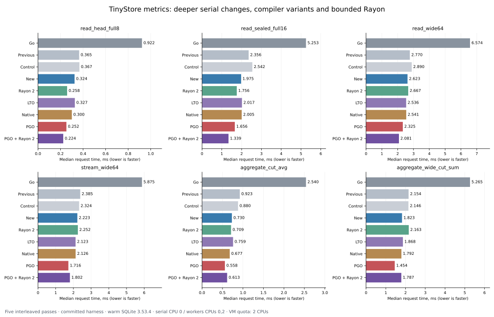

# TinyStore: deeper Rust metrics optimizations, compiler variants and bounded Rayon — 2026-10-08

The new portable serial path reduces a 16-series sealed Read from 2.356 to 1.975 ms relative to the preceding optimized Rust port remeasured in this session. Portable PGO reaches 1.6565 ms, and PGO with two Rayon workers reaches 1.339 ms; Go takes 5.253 ms. Cut average moves from 0.923 to 0.730 to 0.558 ms, versus 2.540 ms for Go. These are cache-resident single-request measurements on this VM. Production TinyStore is unchanged.

This round measured a committed research harness, [16df44bff8bc7f18313d0806492a7c8304fbc9b6](https://github.com/tinyshed/research/commit/16df44bff8bc7f18313d0806492a7c8304fbc9b6), against TinyStore [e307c48a40126aad0e2873b6bf3aaedef8115483](https://github.com/tinyshed/tinystore/commit/e307c48a40126aad0e2873b6bf3aaedef8115483). The earlier [native-path](metrics-native-2026-10-08.md) and [allocation/Rayon](metrics-optimization-2026-10-08.md) reports preserve preliminary runs of uncommitted prototypes. Their numbers are not combined with this round. The preceding optimized Rust baseline and Go were measured again here.

## What the comparisons isolate

| Variant | Source and switches | Compiler and workers |
| --- | --- | --- |
| Go | Real public metrics API at the pinned TinyStore commit | Go 1.27.1, GOMAXPROCS=1 |
| Previous | The preceding optimized Rust port, preserved in reference-rust; fast exact/codec enabled | Ordinary release, serial |
| Control | New source, all four deep switches disabled | Ordinary release, serial |
| New | New source, all four deep switches enabled | Ordinary release, serial |
| Rayon 2 | New algorithms | Ordinary release, bounded two-worker pool |
| LTO | New algorithms | Portable thin LTO, one codegen unit, serial |
| Native | New algorithms | The same LTO flags plus target-cpu=native, serial |
| PGO | New algorithms | The same portable LTO flags plus profile-use, serial |
| PGO + Rayon 2 | New algorithms | Portable PGO and the bounded two-worker pool |

All Rust variants enable the previous fast exact sum/average and codec options. **New versus Control isolates the four new switches in the same source and executable.** New versus Previous also includes the intervening source and ownership/layout changes. Compiler comparisons use LTO as the baseline for native CPU generation and PGO; comparing those builds only with the ordinary release would mix compiler effects. The telemetry executable is separate and never supplies latency timings.

The independent tuning bits are 1 for word-based packed residual/Huffman readers, 2 for shared packed-head storage and bounded reusable decode scratch, 4 for decoding into validated reusable buffers consumed by query folding, and 8 for operation-specialized aggregate arithmetic. Dispatch occurs before the per-point arithmetic loop; count/min/max avoid unnecessary exact integer construction, while sum/average/delta/increase retain their exact result contracts. Complete selected block or mutable-head validation preserves corruption and output-limit error precedence. Mutable-head body/stored slices share packed storage; worker-local scratch has an explicit cache bound and discards oversized capacity.

Rayon receives owned snapshot data after the SQLite transaction closes. The Connection stays on the calling thread. One global pool has at most two workers, batches contain at most eight series, and indexed consumption preserves series/Stream order, consumer stops and global limits. Counter state remains ordered within each series, and grouped values merge exactly before rounding. Normal timing uses the existing ≥2-series/≥4096-decoded-sample heuristic, not forced parallelism. Verification forces worker execution even on small queries.

## Correctness and traces

Before timing, 39 Rust tests passed, including scalar/word equivalence and malformed-input guards, immutable/shared head storage and scratch rollback/reentrancy, exact arithmetic, every aggregate operation, signed zero, finite extremes, summary/group merges, bucket boundaries, ordered Stream callbacks and error precedence. The harness compared 56 traces across 13 configurations, or 728 configuration-trace checks. Canonical series/labels, timestamps and float bits, all aggregate bucket fields, maintenance outcomes and final logical digests matched. Twenty-nine selection plans and both guard suites matched; guard coverage includes TooOld/TooNew, resource limits, nonfinite aggregates and atomic rollback.

Every process starts from its own byte-identical copy of a closed Go-created fixture named metrics.db. Each timed write closes its file and production Go reopens it outside the timer; final logical digests match across the compared variants in every retained pass. This checks logical format compatibility. It does not claim compressed bytes or whole database files are identical, and this deeper round introduces no storage-size saving claim.

There are 42 public-operation workloads × nine main variants × five passes, plus nine workloads × four independent switch variants × five passes: **2070 retained timings**. A fixed 16-operation pilot on Previous selects a common operation count targeting a 120-ms timed trace; the pilot itself is not a fixed-duration 120-ms measurement. Registration is capped at 16 timed calls, scrape at 512, other writes at 4096 and reads/aggregates at 16384. Registration's 32 warm calls plus timed output must fit the unchanged 100,000-point query ceiling. Maintain/full expiry are fresh-copy, one-call cases without warming; other traces run the same 32 warm calls and operation indices. No adaptive mutating state is transferred between stacks or passes.

The variant order rotates by workload and pass and reverses on alternating passes. Timers include request/input construction, public validation, SQLite/query work, result materialization, Rust destruction or normal Go GC, and durable commit work. Open/migration, fixture copying, verification/full hashes, cross-reading and later inspection are outside timing. Go retains its query sink output through the loop; Rust consumes and destroys each owning Read/aggregate output immediately after black_box. Both retain the final Stream callback result. Go-versus-Rust ratios include these consumer-lifetime differences as well as native/backend and engine differences; they are not an isolated language comparison. Rust-versus-Rust variants use the same output lifetime. No builds, tests or other experiments ran during the retained timing interval; host/storage activity remains outside the harness's control.

## Corpus and SQLite configuration

The synthetic decimal values are float64((sample_index*17+series_id)%997)/10. Timestamp origin is 1700000000000 and frozen normal Now is origin+6000. The sealed/ready fixtures have eight gauge and eight counter series × 4801 points. Maintain seals 4800 points per series into 320 blocks and leaves 16 mutable points; series share compact clocks. The head fixture has eight × 2001 points, scrape has 100 × 240, and empty contains the migrated schema. Wide has 64 gauge series × 1441 points = 92,224 points, with 384 sealed blocks. The separate 12-series × 481-point edge corpus covers constant/change/decimal/XOR values, irregular times, signed zero, subnormals, NaN payloads/infinities, exact cancellation/overflow and counter resets. Edge Read and two valid edge aggregates are timed as well as verified.

The main sealed file is 132 KiB and wide is 140 KiB, inside the 1 MiB SQLite cache. Common clocks and unusually compact decimal bodies favor CPU/backend testing. This is neither a cold-storage test nor a production/high-cardinality corpus. Fixtures are generated locally, never committed; their closed-file hashes are:

| Fixture | File bytes | SHA-256 |
| --- | ---: | ---: |
| sealed | 135168 | 2df2463ca583e0308616687aa2360391b5f7bd9cb97b2e9a5d7c348c021686d8 |
| ready | 102400 | 212dfdab7278b38b37b47b17c52e4e2b3c53e147dc4f2ff15abc75dfc5d8becc |
| head | 77824 | 2f1f5c1772d62ec5910292d9b8b5cdefe610105bd15e2769c771962c59dc71a0 |
| scrape | 102400 | 52b672041cda3b7ad68f77731c734b322bd86d54b5038927c9da1ee5c752b56a |
| empty | 69632 | 515600698251e249a8e1c466a797d7e0a5027a0e64f56285fe693b147ca68a5a |
| edge | 81920 | d3a0ab8cb53f80d5dfae960205a38779f9823f51d03f8a38f9c81dc295ca1a10 |
| wide | 143360 | 579a2fc5a190197f3afe8780a5a0f91a56d8fe10139e9c66c5e9c9e46a20db40 |

Both backends report SQLite **3.53.4**, with source_id `2026-07-24 19:02:57 bf7c7f30031888f4e796e429ab3978879485813aaca6f641c7b33e4e09459bcc`. Rust uses rusqlite 0.40.1 and the same pinned custom native SQLite archive compiled with -O2, -fPIC and -pthread; no SQLite optimization-level change is attributed to the Rust compiler variants. The [native builder](../sqlite-bench/build_native.py) and [recorded native build](data/metrics-deep-2026-10-08/native-build.json) retain all custom flags and archive/source/header hashes. Go runs ncruces/go-sqlite3 translated ahead of time through wasm2go, with no interpreted WASM in the measured loops.

Readbacks retain 4096-byte pages, WAL, synchronous=FULL, foreign_keys=1, busy_timeout=5000, fullfsync=1, checkpoint_fullfsync=1, cache_size=-1024, trusted_schema=0, mmap_size=0 and wal_autocheckpoint=1000. Readers are query-only and statement capacity is 32. Metrics keeps SQLite's default length limit, rather than the earlier SQL microbenchmark's artificial 1 MiB limit. Head capacity is raised equally to 1,048,576 samples/16 MiB and input capacity to 100,000 samples/64 MiB; query ceilings remain the production defaults. Retention is 30 days, lateness zero, maximum block span one day and maintenance capacity 64 series. Each stack has one reader and one writer.

Native SQLite retains THREADSAFE=1/global mutexes, automatic initialization and Unix VFS. Go isolates translated THREADSAFE=0 instances and uses its custom VFS. Those are existing backend differences, so the Go/native ratio is not an isolated language comparison. SQLite and zstd are statically embedded; [readelf evidence](data/metrics-deep-2026-10-08/linkage.txt) shows no dynamic libsqlite3.so or libzstd.so dependency. System libm/libgcc_s/libc/the loader remain dynamic. Native Huffman uses private symbols from the pinned zstd build and needs production ABI/build review.

Plans explain why aggregate gains differ: whole sum uses 160 summaries and decodes only eight head points; cut sum/average use 80 summaries and decode 19,208 points. Read16 decodes 76,816 points. Wide cut aggregates use 192 summaries and decode 46,144 points. Narrow reads still fetch/validate/decode the required complete block or head chunk. The [29 plans](data/metrics-deep-2026-10-08/plans.json) preserve all selected series, blocks, summary shortcuts, fetched bytes and decoded counts.

## All public-operation medians

Milliseconds per public call, median of five passes, lower is faster. A scrape call contains 100 input points; registration creates eight series × 240 points per call. All nine main variants are shown. [medians.csv](data/metrics-deep-2026-10-08/medians.csv) preserves unrounded values; [passes.md](data/metrics-deep-2026-10-08/passes.md) shows every retained pass, including ablations. [timings.csv](data/metrics-deep-2026-10-08/timings.csv) and the original [JSONL](data/metrics-deep-2026-10-08/timings.jsonl) retain counts, order, UTC and write cross-reader digests.

| Workload | Timed ops | Go, ms | Previous, ms | Control, ms | New, ms | Rayon 2, ms | LTO, ms | Native, ms | PGO, ms | PGO + Rayon 2, ms |
| --- | ---: | ---: | ---: | ---: | ---: | ---: | ---: | ---: | ---: | ---: |
| ingest_append1 | 188 | 0.5943 | 0.4355 | 0.3957 | 0.3856 | 0.3583 | 0.4074 | 0.3826 | 0.3626 | 0.3262 |
| ingest_replace1 | 213 | 0.8435 | 0.6465 | 0.5586 | 0.6003 | 0.5528 | 0.5272 | 0.5787 | 0.5400 | 0.5975 |
| ingest_scrape100 | 50 | 6.3312 | 2.5106 | 2.6054 | 2.6740 | 2.8347 | 2.7281 | 2.7639 | 2.5135 | 2.5693 |
| ingest_register8 | 16 | 1.9966 | 1.0436 | 0.9934 | 1.0909 | 1.0185 | 1.2009 | 0.9846 | 0.9705 | 0.9696 |
| ingest_shuffled240 | 197 | 1.0240 | 0.6001 | 0.6690 | 0.5706 | 0.6092 | 0.5865 | 0.5733 | 0.5577 | 0.5700 |
| ingest_duplicates240 | 212 | 0.9054 | 0.5848 | 0.5918 | 0.5451 | 0.5611 | 0.6105 | 0.5733 | 0.5808 | 0.5292 |
| maintain_ready | 1 | 88.2098 | 37.0408 | 34.0729 | 33.8596 | 32.0371 | 30.7369 | 30.2930 | 31.3311 | 30.7518 |
| expire_all | 1 | 16.2079 | 10.2353 | 11.1418 | 10.3906 | 10.8385 | 10.2786 | 9.6282 | 9.5454 | 10.8673 |
| read_head_point | 7320 | 0.0557 | 0.0168 | 0.0172 | 0.0169 | 0.0152 | 0.0149 | 0.0151 | 0.0132 | 0.0136 |
| read_head_full8 | 332 | 0.9223 | 0.3651 | 0.3674 | 0.3243 | 0.2582 | 0.3267 | 0.3002 | 0.2518 | 0.2239 |
| read_sealed_point | 3893 | 0.0934 | 0.0303 | 0.0304 | 0.0298 | 0.0298 | 0.0287 | 0.0286 | 0.0252 | 0.0246 |
| read_sealed_boundary | 653 | 0.4298 | 0.1875 | 0.1786 | 0.1817 | 0.1932 | 0.1736 | 0.1669 | 0.1398 | 0.1427 |
| read_sealed_full8 | 114 | 2.6763 | 1.0961 | 1.1456 | 1.0071 | 0.8952 | 1.0032 | 0.9969 | 0.8421 | 0.7389 |
| read_sealed_full16 | 58 | 5.2531 | 2.3561 | 2.5421 | 1.9749 | 1.7558 | 2.0170 | 2.0048 | 1.6565 | 1.3387 |
| read_filtered_one | 1059 | 0.4123 | 0.1259 | 0.1315 | 0.1160 | 0.1149 | 0.1234 | 0.1172 | 0.0958 | 0.0944 |
| stream_sealed_full8 | 130 | 2.9047 | 0.9453 | 1.0236 | 0.9157 | 0.8473 | 0.8798 | 0.9037 | 0.7050 | 0.6766 |
| read_where | 292 | 1.1370 | 0.4349 | 0.4413 | 0.4105 | 0.4296 | 0.3953 | 0.3829 | 0.3212 | 0.3556 |
| read_prefix | 804 | 0.4122 | 0.1583 | 0.1669 | 0.1483 | 0.1379 | 0.1576 | 0.1414 | 0.1179 | 0.1163 |
| read_noneof | 155 | 2.1571 | 0.8436 | 0.9253 | 0.8350 | 0.7162 | 0.7723 | 0.8025 | 0.6394 | 0.5992 |
| read_since | 383 | 0.8167 | 0.3096 | 0.3298 | 0.3000 | 0.3733 | 0.2951 | 0.2917 | 0.2362 | 0.3041 |
| aggregate_count | 622 | 0.3763 | 0.1567 | 0.1553 | 0.1574 | 0.1720 | 0.1508 | 0.1464 | 0.1217 | 0.1408 |
| aggregate_sum | 565 | 0.3770 | 0.1795 | 0.1828 | 0.1857 | 0.2172 | 0.1776 | 0.1744 | 0.1515 | 0.1512 |
| aggregate_avg | 573 | 0.3963 | 0.1877 | 0.1870 | 0.1757 | 0.1913 | 0.1782 | 0.1694 | 0.1458 | 0.1468 |
| aggregate_min | 701 | 0.3728 | 0.1518 | 0.1532 | 0.1567 | 0.1791 | 0.1493 | 0.1498 | 0.1272 | 0.1225 |
| aggregate_max | 845 | 0.3861 | 0.1502 | 0.1562 | 0.1627 | 0.1590 | 0.1496 | 0.1494 | 0.1206 | 0.1321 |
| aggregate_delta | 720 | 0.3835 | 0.1670 | 0.1666 | 0.1689 | 0.1754 | 0.1615 | 0.1625 | 0.1484 | 0.1516 |
| aggregate_increase | 544 | 0.4221 | 0.2163 | 0.2194 | 0.2159 | 0.2245 | 0.2116 | 0.2055 | 0.1643 | 0.1708 |
| aggregate_rate | 560 | 0.4120 | 0.2144 | 0.2181 | 0.2157 | 0.2124 | 0.2022 | 0.1928 | 0.1573 | 0.1706 |
| aggregate_cut_sum | 140 | 2.3434 | 0.8222 | 0.8238 | 0.7223 | 0.7655 | 0.7844 | 0.6803 | 0.5772 | 0.5874 |
| aggregate_cut_avg | 131 | 2.5398 | 0.9232 | 0.8800 | 0.7297 | 0.7093 | 0.7586 | 0.6770 | 0.5583 | 0.6135 |
| aggregate_grouped_sum | 669 | 0.4362 | 0.1910 | 0.1978 | 0.1863 | 0.1822 | 0.1854 | 0.1666 | 0.1375 | 0.1393 |
| aggregate_grouped_increase | 515 | 0.4558 | 0.2243 | 0.2275 | 0.2245 | 0.2234 | 0.2228 | 0.2034 | 0.1654 | 0.1681 |
| read_wide64 | 41 | 6.5737 | 2.7702 | 2.8902 | 2.6226 | 2.6667 | 2.5363 | 2.5414 | 2.3249 | 2.0805 |
| stream_wide64 | 54 | 5.8752 | 2.3846 | 2.3243 | 2.2229 | 2.2521 | 2.1232 | 2.1260 | 1.7155 | 1.8022 |
| aggregate_wide_sum | 183 | 1.2445 | 0.6754 | 0.6841 | 0.6668 | 0.6856 | 0.6439 | 0.6591 | 0.5227 | 0.5442 |
| aggregate_wide_cut_sum | 58 | 5.2648 | 2.1542 | 2.1463 | 1.8226 | 2.1632 | 1.8676 | 1.7916 | 1.4538 | 1.7874 |
| aggregate_wide_cut_avg | 52 | 5.7631 | 2.1374 | 2.1894 | 1.9071 | 2.1183 | 1.9015 | 1.7483 | 1.4606 | 1.6697 |
| aggregate_wide_cut_count | 55 | 4.4592 | 2.0015 | 1.9338 | 1.5812 | 1.8093 | 1.4461 | 1.4328 | 1.3222 | 1.4037 |
| aggregate_wide_grouped_cut_sum | 54 | 5.3581 | 2.1028 | 2.1592 | 1.9245 | 1.9844 | 1.6754 | 1.6851 | 1.5107 | 1.4568 |
| read_edge | 412 | 0.6022 | 0.2080 | 0.2132 | 0.1843 | 0.2456 | 0.1758 | 0.1772 | 0.1621 | 0.2174 |
| aggregate_edge_sum_3 | 8234 | 0.0554 | 0.0161 | 0.0156 | 0.0166 | 0.0175 | 0.0154 | 0.0158 | 0.0136 | 0.0151 |
| aggregate_edge_increase_10 | 8005 | 0.0574 | 0.0171 | 0.0166 | 0.0164 | 0.0163 | 0.0162 | 0.0167 | 0.0148 | 0.0146 |

For Read16, Control/New is 1.29×; Previous/New is 1.19×. For cut average, those ratios are 1.21× and 1.27×. The new switches give additional decoded-path gains, while whole-block aggregates have very little point work to remove and show no uniform portable-release improvement.

Durable writes are small and noisy here. Scrape changes from 2.511 ms on Previous to 2.674 ms on New; the deeper switches establish no added scrape gain. Rayon does not parallelize the writer, so variation between its write rows cannot be credited to workers. For example, Control append spans 0.389–0.701 ms and New spans 0.352–0.468 ms. Retained FULL fsync/checkpoint behavior and the shared VM limit causal conclusions from small write differences.

## Compiler effects and held-out PGO work

LTO flags are `-C lto=thin -C embed-bitcode=yes -C codegen-units=1`. Native adds `-C target-cpu=native`. PGO adds profile-use to that portable LTO configuration, with no target-cpu=native. The training executable is a separate instrumented build. Training runs head8, sealed8, cut sum and count for 256 calls each, scrape for 64, and Maintain once; other than Maintain, training has 32 warm calls. Wide64, full16, IEEE edge traces, prefix/NoneOf and grouped queries are held out. They still use the same small synthetic value distributions and code families, so held-out improvement does not establish generalization to unrelated production workloads.

The merged training profile SHA-256 is `300d0130630926ccca9e74ab97c0bb312e8890e618cca0ba5238c82c22aebfa6`. Compiler flags, training traces, profile/tool versions and executable hashes are in [environment.json](data/metrics-deep-2026-10-08/environment.json). Ratios below divide the named baseline by its candidate; greater than one is faster. The native and PGO comparisons therefore use LTO, not the default build.

| Workload | New / LTO | LTO / native | LTO / PGO | PGO / PGO+Rayon 2 |
| --- | ---: | ---: | ---: | ---: |
| read_head_full8 | 0.99× | 1.09× | 1.30× | 1.12× |
| read_sealed_full16 | 0.98× | 1.01× | 1.22× | 1.24× |
| read_wide64 | 1.03× | 1.00× | 1.09× | 1.12× |
| stream_wide64 | 1.05× | 1.00× | 1.24× | 0.95× |
| aggregate_cut_sum | 0.92× | 1.15× | 1.36× | 0.98× |
| aggregate_cut_avg | 0.96× | 1.12× | 1.36× | 0.91× |
| aggregate_wide_cut_sum | 0.98× | 1.04× | 1.28× | 0.81× |
| aggregate_wide_cut_count | 1.09× | 1.01× | 1.09× | 0.94× |
| aggregate_wide_grouped_cut_sum | 1.15× | 0.99× | 1.11× | 1.04× |

PGO improves Read16 1.22× and cut average 1.36× relative to LTO. Host-specific generation is uneven: Read16 is 1.01×, while cut average is 1.12×. Thin LTO alone also has mixed results. These are separate deployment/build choices, not automatic additions to a portable default. [compiler-ratios.csv](data/metrics-deep-2026-10-08/compiler-ratios.csv) covers every workload.

Two workers help PGO Read16 a further 1.24×, but make PGO wide cut sum slower (0.81×) and wide Stream slightly slower (0.95×). The current threshold does not prevent those regressions. A two-CPU quota and virtual topology cannot establish scaling to 8–16 physical cores or concurrent server throughput.

## Independent switch ablations

These four variants enable only the named deep switch; the previous fast exact/codec options remain on. They share Control's ordinary release executable. All-four effects need not equal a product of isolated effects.

| Workload | Control, ms | Bits only, ms | Buffers only, ms | Fused only, ms | Specialized only, ms | All four, ms |
| --- | ---: | ---: | ---: | ---: | ---: | ---: |
| ingest_scrape100 | 2.6054 | 2.6487 | 2.5440 | 2.7675 | 2.5863 | 2.6740 |
| maintain_ready | 34.0729 | 32.5207 | 31.9709 | 34.9318 | 34.1939 | 33.8596 |
| read_head_full8 | 0.3674 | 0.3405 | 0.3495 | 0.3582 | 0.3727 | 0.3243 |
| read_sealed_full16 | 2.5421 | 2.0801 | 2.1926 | 2.2948 | 2.3525 | 1.9749 |
| aggregate_sum | 0.1828 | 0.1883 | 0.1807 | 0.1824 | 0.1796 | 0.1857 |
| aggregate_cut_sum | 0.8238 | 0.8390 | 0.8621 | 0.8499 | 0.7975 | 0.7223 |
| read_wide64 | 2.8902 | 2.6834 | 2.8456 | 2.7735 | 2.9597 | 2.6226 |
| aggregate_wide_cut_sum | 2.1463 | 2.0820 | 2.2332 | 2.1452 | 1.9593 | 1.8226 |
| aggregate_wide_grouped_cut_sum | 2.1592 | 2.0426 | 2.2239 | 2.3728 | 2.0590 | 1.9245 |

Control divided by each candidate:

| Workload | Bits only | Buffers only | Fused only | Specialized only | All four |
| --- | ---: | ---: | ---: | ---: | ---: |
| ingest_scrape100 | 0.98× | 1.02× | 0.94× | 1.01× | 0.97× |
| maintain_ready | 1.05× | 1.07× | 0.98× | 1.00× | 1.01× |
| read_head_full8 | 1.08× | 1.05× | 1.03× | 0.99× | 1.13× |
| read_sealed_full16 | 1.22× | 1.16× | 1.11× | 1.08× | 1.29× |
| aggregate_sum | 0.97× | 1.01× | 1.00× | 1.02× | 0.98× |
| aggregate_cut_sum | 0.98× | 0.96× | 0.97× | 1.03× | 1.14× |
| read_wide64 | 1.08× | 1.02× | 1.04× | 0.98× | 1.10× |
| aggregate_wide_cut_sum | 1.03× | 0.96× | 1.00× | 1.10× | 1.18× |
| aggregate_wide_grouped_cut_sum | 1.06× | 0.97× | 0.91× | 1.05× | 1.12× |

Bits alone helps Read16 1.22× in this run; buffers alone helps 1.16× and all four help 1.29×. Specialization alone helps wide cut sum 1.10×. Several isolated effects are weak or negative. A useful noise check is specialization-only on Read16: its arithmetic specialization is unused by Read, yet the median moves by about 8%. Small differences between switches therefore need the retained ranges, not a universal mechanism claim. [ablations.csv](data/metrics-deep-2026-10-08/ablations.csv) and full pass values preserve those comparisons.

## Residual and Huffman kernels

The microbenchmarks run the same ordinary-release executable on CPU 0 with scalar/word switching only. Each mode has five scalar and five word processes, 2048 timed decodes and 32 warm decodes per process. Residual inputs contain 239 fixed-width values; Huffman reconstructs 4096 bytes from a 1406-byte native Huffman message. Fixture generation, compression and validation precede the timer. Timed decoding includes fresh output ownership and destruction. The renderer asserts matching input/output hashes for scalar and word variants in every case; [kernels.jsonl](data/metrics-deep-2026-10-08/kernels.jsonl) and [kernels.csv](data/metrics-deep-2026-10-08/kernels.csv) retain the hashes, counts and all five passes.

| Kernel | Output values | Input bytes | Scalar, ns/op | Words, ns/op | Scalar / words |
| --- | ---: | ---: | ---: | ---: | ---: |
| Residual width 1 | 239 | 30 | 267.18 | 205.25 | 1.30× |
| Residual width 2 | 239 | 60 | 468.25 | 244.13 | 1.92× |
| Residual width 5 | 239 | 150 | 1119.22 | 240.11 | 4.66× |
| Residual width 8 | 239 | 239 | 1750.43 | 247.81 | 7.06× |
| Residual width 13 | 239 | 389 | 4006.15 | 322.39 | 12.43× |
| Residual width 32 | 239 | 956 | 7973.60 | 534.40 | 14.92× |
| Residual width 63 | 239 | 1883 | 15133.90 | 1043.64 | 14.50× |
| Residual width 64 | 239 | 1912 | 14861.65 | 842.05 | 17.65× |
| Huffman | 4096 | 1406 | 52084.86 | 15739.27 | 3.31× |

Residual decode gains range from 1.30× at one bit to 17.65× at 64 bits; the Huffman case gains 3.31×. These isolated gains do not multiply into request speedups. End-to-end requests also match/fetch labels, parse directories, process summaries and allocate/materialize output, and this compact decimal corpus does not exercise each residual width equally.

## Instrumented time and Rust allocation requests

Eleven workloads have three Control and three New profiling processes, 32 warm operations and 32 instrumented operations each: 66 processes. Medians below divide counters by the 32 operations. The separate telemetry build counts successful Rust alloc/alloc_zeroed/realloc requests, and requested bytes count every reallocation's new size in full. These are allocation traffic, not live heap, retained bytes or process RSS. Native SQLite/zstd/Huffman C allocations bypass this Rust allocator counter.

| Workload | Control calls/op | New calls/op | Control requested KiB/op | New requested KiB/op |
| --- | ---: | ---: | ---: | ---: |
| read_head_point | 97 | 77 | 16.88 | 8.96 |
| read_head_full8 | 1102 | 750 | 828.27 | 323.05 |
| read_sealed_full8 | 3746 | 3394 | 1658.31 | 1053.91 |
| read_sealed_full16 | 8199 | 7495 | 3367.66 | 2158.86 |
| read_wide64 | 10329 | 9305 | 3905.47 | 2453.03 |
| stream_wide64 | 10324 | 9300 | 3893.84 | 2441.40 |
| aggregate_sum | 2702 | 2670 | 398.37 | 398.04 |
| aggregate_count | 2107 | 2075 | 356.39 | 356.06 |
| aggregate_cut_sum | 4325 | 4133 | 867.74 | 565.37 |
| aggregate_wide_cut_sum | 12487 | 11847 | 2018.87 | 1291.31 |
| read_edge | 900 | 792 | 476.56 | 273.50 |

The requested bytes for Read16 fall from 3367.66 to 2158.86 KiB/op, while allocation calls move from 8199 to 7495. Cut sum requests fall from 867.74 to 565.37 KiB/op. Those reductions establish less Rust allocation traffic on these paths; they do not establish a corresponding RSS reduction.

Stage times are **inclusive, instrumented and overlapping**. Snapshot contains registry/head/group work; process contains decode/folding; fold_series contains decoded blocks as well as arithmetic. They are neither additive CPU samples nor estimates of exclusive functions. Instrumentation and allocator bookkeeping change timing; use the separate uninstrumented table for latency claims. Process below means read_process or aggregate_process as appropriate.

| Workload | Control total, ms | New total, ms | Control snapshot, ms | New snapshot, ms | Control process, ms | New process, ms |
| --- | ---: | ---: | ---: | ---: | ---: | ---: |
| read_head_point | 0.0201 | 0.0210 | 0.0137 | 0.0158 | 0.0044 | 0.0039 |
| read_head_full8 | 0.4170 | 0.3596 | 0.0485 | 0.0444 | 0.3589 | 0.3054 |
| read_sealed_full8 | 1.1525 | 1.0191 | 0.2610 | 0.2625 | 0.8680 | 0.7404 |
| read_sealed_full16 | 2.4014 | 2.2047 | 0.4956 | 0.4999 | 1.8624 | 1.6833 |
| read_wide64 | 3.1294 | 2.6078 | 0.7155 | 0.6438 | 2.3616 | 1.9203 |
| stream_wide64 | 2.4767 | 2.2406 | 0.6656 | 0.6461 | 1.8016 | 1.5929 |
| aggregate_sum | 0.2320 | 0.1937 | 0.1867 | 0.1527 | 0.0408 | 0.0396 |
| aggregate_count | 0.1592 | 0.1772 | 0.1450 | 0.1633 | 0.0130 | 0.0133 |
| aggregate_cut_sum | 0.8413 | 0.6909 | 0.2006 | 0.2016 | 0.6384 | 0.4870 |
| aggregate_wide_cut_sum | 2.2485 | 1.9305 | 0.6245 | 0.6475 | 1.6185 | 1.2754 |
| read_edge | 0.2286 | 0.1969 | 0.0991 | 0.0885 | 0.1311 | 0.1020 |

For instrumented cut sum, snapshot is nearly unchanged at 0.201/0.202 ms, while aggregate processing falls from 0.638 to 0.487 ms. Instrumented whole count is dominated by snapshot work and its total even increases between those profile medians; less folding time does not imply a universal total-query win. [profiles.csv](data/metrics-deep-2026-10-08/profiles.csv) preserves all nested stage counts, time and allocation requests, with three-process totals in [passes.md](data/metrics-deep-2026-10-08/passes.md).

## Process memory with caller-owned output

Six workloads × five variants × three independent processes give 90 RSS runs. Each process retains 16 Read/aggregate results. Go runs GC before sampled RSS; Rust drops temporary results normally. Stream consumes one series at a time and retains only the final callback result. Its zero retained_samples means no accumulated query outputs, not that the final series owns no samples. The table shows median GNU time peak RSS, with sampled VmRSS and every process preserved in [memory.csv](data/metrics-deep-2026-10-08/memory.csv), [JSONL](data/metrics-deep-2026-10-08/memory.jsonl) and full passes.

| Workload | Retained sample points | Go, MiB | Previous, MiB | New, MiB | Rayon 2, MiB | PGO, MiB |
| --- | ---: | ---: | ---: | ---: | ---: | ---: |
| read_head_full8 | 256128 | 19.90 | 7.44 | 7.70 | 7.90 | 7.57 |
| read_sealed_full16 | 1229056 | 50.28 | 23.20 | 23.40 | 23.42 | 23.23 |
| read_wide64 | 1475584 | 67.03 | 27.64 | 27.76 | 27.88 | 27.39 |
| stream_wide64 | 0 | 15.53 | 4.39 | 4.70 | 5.10 | 4.43 |
| aggregate_cut_sum | 0 | 14.45 | 4.38 | 4.39 | 4.48 | 4.16 |
| aggregate_wide_cut_sum | 0 | 15.23 | 5.20 | 5.40 | 5.55 | 5.14 |

Read16 retains 1,229,056 timestamp/value points, about 18.75 MiB of content before containers; wide Read retains 1,475,584 points, about 22.52 MiB. Deep optimizations reduce allocation traffic but do not produce a clear further peak-RSS saving over Previous here. Stream wide64 grows from 4.39 to 4.70 MiB and to 5.10 MiB with workers. Process RSS includes SQLite/zstd, native and language allocators, reusable pages, output ownership and stacks. Linux sampled VmRSS and ru_maxrss can differ slightly. These explicit retention scenarios establish neither intrinsic language RAM costs nor bounds for an arbitrary application.

## Environment, reproduction and limits

Retained timing/memory/kernel interval: **2026-10-08T15:27:14.519691+00:00 to 2026-10-08T15:32:44.018064+00:00 UTC**. Diagnostic profiles preceded that interval. Linux 6.18.44 x86_64, glibc 2.41, AMD EPYC 9V74 KVM VM, three visible vCPUs, cpu.max `200000 100000` (two-CPU quota), memory limit 8 GiB, overlayfs. Serial variants and kernels use CPU 0; Rayon uses CPUs 0,2, selected for different reported L1 cache groups. Guest topology does not reliably establish physical host cores. Go is 1.27.1 with GOMAXPROCS=1/default GOGC=100. Rust is 1.99.0 (b940084d7, 2026-09-28), LLVM 23.1.1, GNU/Linux target. SQLite was compiled by GCC 14.2.0 with the pinned -O2 native flags. Full OS/CPU/compiler output, fixture hashes, measured source hashes and all executable/profile digests are preserved in the [environment](data/metrics-deep-2026-10-08/environment.json) and [verified source/binary hashes](data/metrics-deep-2026-10-08/verified-hashes.json).

From `<repo>/tinystore/metrics-max-bench`, follow the [reproduction README](../metrics-max-bench/README.md) to initialize the measured TinyStore submodule, regenerate fixtures/native SQLite, build the preceding/new/compiler/telemetry variants, run tests, verify and run the quiet fixed traces. The measured harness commit records source before timing. Source and executable hashes were checked unchanged after the completed run. Fixtures, executable files and generated C/PGO outputs remain local and are excluded from publication. Embedded PGO path strings in the published evidence use `<repo>/tinystore/metrics-max-bench/pgo/...`; numeric measurements and embedded digests are unchanged.

This report, CSV/pass tables and standalone SVG/PNG are generated by [render_deep_report.py](../metrics-max-bench/render_deep_report.py), an **unmeasured documentation helper added after the run**. It reads preserved output and never executes benchmark workloads. Regenerate with `python3 render_deep_report.py`; Matplotlib/NumPy are needed for plots. The later publication manifest records original versus sanitized evidence and renderer artifacts.

Publication compatibility: moving the source submodule to the measured e307c48 commit also required adapting the older bench/compare, bench/perf and bench/records modules to the current metrics Series/Range fields and records Scan API, plus dependency tidying in bench/kv, bench/perf, bench/records, server-spike and spike. All 16 legacy and current Go modules compiled successfully against the publication pin. This is repository build compatibility, not a remeasurement of historical reports; production source remains unchanged.

The Rust port implements synchronous storage/query paths, query budgets and snapshot deadlines. It still omits production reader pooling, admission and shared memory reservations, caller cancellation, instruments, runtime directory locks/lifecycle, background maintenance scheduling, snapshots/backups and server APIs. Partial retention/group merge/quarantine code is not a substitute for fault and concurrency verification. No conclusion is made about cold I/O, power-loss durability, production concurrent throughput, wide physical-core scaling or a complete migration.

The next implementation candidate is the measured serial decoding/allocation work, with exact/error contracts retained. PGO merits separate production-distribution training and held-out measurement before choosing it; native CPU code generation remains a host-specific build option. Rayon needs workload-sensitive selection and shared concurrent resource limits: it accelerates several reads and regresses several aggregates even within this small corpus. Durable write preparation and the serial SQLite writer need separate experiments; the deeper query switches establish no additional scrape benefit.
