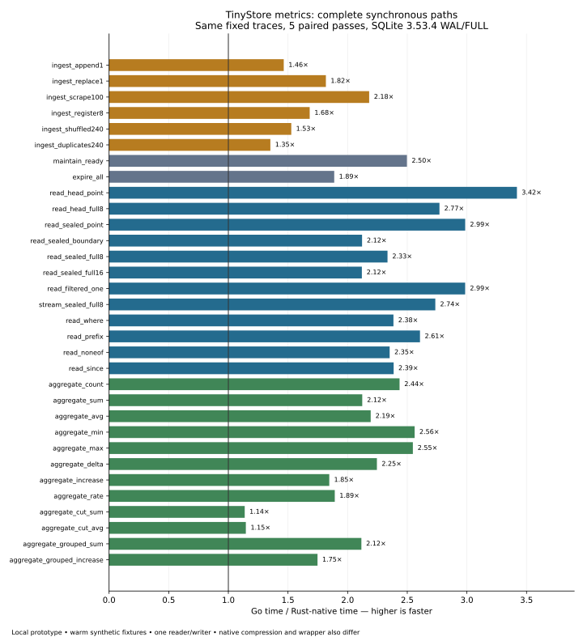

# Complete metrics paths: Go and Rust/native — 2026-10-08

This report preserves a preliminary run of a local, uncommitted research prototype. Measured source/executable SHA256 hashes and raw samples are preserved. Production TinyStore remains unchanged. This is a complete synchronous data-path comparison, not a production Rust migration or a published formal measurement round.

Rust/native improved ingest medians by 1.35–2.18×, reads by 2.12–3.42×, sealing by 2.50× and full expiry by 1.89×. Whole-block aggregates improved 1.75–2.56×, including grouping; cut-block sum/avg improved only 1.14–1.15×. The earlier isolated SQLite/kernel ratios cannot be multiplied to predict these results.

## What actually runs

The Go baseline calls the real public `metrics.Open`, `Ingest`, `Maintain`, `Read`, `Stream`, `Aggregate`, `ExplainRead` and `ExplainAggregate` on TinyStore commit `e307c48a40126aad0e2873b6bf3aaedef8115483`. The runtime is Manual with a frozen clock, so no maintenance/instrumentation work races with a measured call.

The Rust prototype ports the same schema and current packed-head, codec, value, clock, directory and exact-summary formats. It performs real registration, dictionary/posting updates, duplicate last-input-wins preparation, packed chunk reuse, head replacement, publication, shared clock ownership, retention, snapshot fetch, label matching, raw decoding and exact aggregate folding. Rust-written files reopen and read through the production Go engine.

Both SQLite backends report version 3.53.4 and the same sqlite_source_id. Rust links the previously pinned custom native archive through rusqlite 0.40.1. Go uses ncruces/go-sqlite3 translated ahead of time through wasm2go; it does not interpret WASM in the measured loops.

## Fixtures and configuration

Timestamp origin is 1700000000000; normal frozen Now is origin+6000. The main decimal gauge/counter values are `float64((sample_index*17+series_id)%997)/10`. The sealed and ready fixtures each contain 8 gauge and 8 counter series × 4801 samples. Maintain seals 4800 samples per series into 320 blocks and leaves 16 mutable points. All series share one 20-block clock group. The long-head fixture has 8 × 2001 points; scrape has 100 × 240 points; empty has only the real migrated schema.

The separate 12-series × 481-point edge fixture covers constant/change-event/decimal/XOR values, irregular times, signed zero, subnormals, NaN payloads and infinities, exact cancellation, finite overflow and counter resets. It is correctness coverage, not the main performance corpus. Synthetic decimal series have unusually compact bodies and common clocks; the main 132 KiB sealed fixture fits the 1 MiB SQLite cache. These are warm CPU/backend workloads, not cold storage, production corpus or high-cardinality tests.

Both stacks retain WAL, synchronous=FULL, foreign_keys=1, busy_timeout=5000, fullfsync=1, checkpoint_fullfsync=1, cache_size=-1024, trusted_schema=0, 4096-byte pages, default wal_autocheckpoint=1000 and mmap_size=0. Reader handles are query-only. Settings and source IDs are checked from readbacks. Statement capacity is 32. This metrics path keeps production SQLite’s default length limit, rather than the earlier SQLite microbenchmark’s artificial 1 MiB limit.

Common engine options raise head capacity to 1,048,576 samples/16 MiB and input capacity to 100,000 samples/64 MiB, matching long-head/large-batch scenarios; query ceilings remain production defaults. Retention is 30 days, lateness zero, maximum block span one day and maintenance capacity 64 series. Each stack owns one reader and one writer.

## Correctness before and after timing

49 scenarios compare rolling canonical hashes of series/labels, timestamp bits, value bits, all aggregate bucket fields, maintenance outcomes and complete final logical sample digests. All match. 23 read/aggregate plans match selected series, blocks, summary shortcuts, fetched bytes and decoded samples. Error checks agree on TooOld/TooNew, decoded/output/series limits, nonfinite aggregate refusal and atomic rollback.

For example, whole sum answers 160 blocks from summaries and decodes 8 head points; cut sum answers 80 blocks from summaries and decodes 19,208 points. Batched all16 reads select 320 blocks and decode 76,816 points. Narrow reads still validate/fetch and decode the required complete block/head chunk.

After every timed mutating trace, the process closes and production Go reopens each file. Final sample digests match between both stacks in every paired pass. Closed-file `internal/dbstat` measurements separately record each table/index’s pages. Logical compatibility is checked; compressed bytes/database files are not claimed identical.

15 Rust unit tests pass: 9 codec, 3 engine, 2 exact arithmetic and 1 Go quoting test. Codec vectors cover 3 time modes × 5 value modes × plain/zstd envelopes, seven residual decoders, regular/plain/runs/exception clocks, checksums, chunk reuse and exact canonical summaries. Rust also decodes 152 actual Go heads and 344 sealed blocks across the fixtures. A separate compatibility probe regenerated all 24 edge blocks/directories with Rust and production Go returned the original 5,772 sample bits/hash.

## Median time per public operation

Milliseconds, lower is faster. Each number is the median of five paired passes. A scrape is one atomic call with 100 input points; registration creates 8 series × 240 points per call; sealing and expiry each process the entire 16-series fixture. Read/Stream counts refer to points returned per call.

| Operation | Go, ms | Rust/native, ms | Go / native | Fixed timed operations |
| --- | ---: | ---: | ---: | ---: |
| `ingest_append1` | 0.5717 | 0.3904 | 1.46× | 285 |
| `ingest_replace1` | 0.9476 | 0.5213 | 1.82× | 150 |
| `ingest_scrape100` | 4.9427 | 2.2666 | 2.18× | 28 |
| `ingest_register8` | 1.7538 | 1.0427 | 1.68× | 16 |
| `ingest_shuffled240` | 0.9813 | 0.6424 | 1.53× | 157 |
| `ingest_duplicates240` | 0.9138 | 0.6758 | 1.35× | 132 |
| `maintain_ready` | 84.7723 | 33.9451 | 2.50× | 1 |
| `expire_all` | 18.7169 | 9.9154 | 1.89× | 1 |
| `read_head_point` | 0.0559 | 0.0164 | 3.42× | 3131 |
| `read_head_full8` | 1.0009 | 0.3614 | 2.77× | 152 |
| `read_sealed_point` | 0.0967 | 0.0324 | 2.99× | 1501 |
| `read_sealed_boundary` | 0.4139 | 0.1952 | 2.12× | 311 |
| `read_sealed_full8` | 2.6605 | 1.1397 | 2.33× | 51 |
| `read_sealed_full16` | 4.7545 | 2.2435 | 2.12× | 29 |
| `read_filtered_one` | 0.3978 | 0.1333 | 2.99× | 350 |
| `stream_sealed_full8` | 2.6487 | 0.9684 | 2.74× | 52 |
| `read_where` | 1.0650 | 0.4467 | 2.38× | 134 |
| `read_prefix` | 0.3992 | 0.1532 | 2.61× | 322 |
| `read_noneof` | 2.0445 | 0.8691 | 2.35× | 38 |
| `read_since` | 0.7949 | 0.3332 | 2.39× | 149 |
| `aggregate_count` | 0.3596 | 0.1477 | 2.44× | 396 |
| `aggregate_sum` | 0.3993 | 0.1881 | 2.12× | 399 |
| `aggregate_avg` | 0.3922 | 0.1788 | 2.19× | 405 |
| `aggregate_min` | 0.3784 | 0.1477 | 2.56× | 339 |
| `aggregate_max` | 0.3862 | 0.1516 | 2.55× | 380 |
| `aggregate_delta` | 0.3856 | 0.1717 | 2.25× | 384 |
| `aggregate_increase` | 0.4279 | 0.2318 | 1.85× | 355 |
| `aggregate_rate` | 0.4363 | 0.2306 | 1.89× | 381 |
| `aggregate_cut_sum` | 2.2531 | 1.9813 | 1.14× | 65 |
| `aggregate_cut_avg` | 2.3661 | 2.0636 | 1.15× | 60 |
| `aggregate_grouped_sum` | 0.4051 | 0.1915 | 2.12× | 313 |
| `aggregate_grouped_increase` | 0.4422 | 0.2530 | 1.75× | 345 |

## Identical timed traces and variation

Every process receives a fresh byte-identical copy of a closed Go-created fixture. A separate pilot on Go copies estimates the iteration count; that fixed count is then used unchanged by both stacks in all retained passes. Normal cases execute the same 32 warm operations followed by the same indices and updates. Sealing/full expiry are first-call one-shot work on independent fresh copies, with no warm operations. No mutating adaptive calibration state carries between stacks or passes.

Pairs are adjacent within each workload, and first/second order alternates by pass and workload. Timers include request/input construction, public validation and work, all query materialization, Rust destruction/normal Go GC, and durable commits. Open, migration verification, fixture copying, full hashing, the post-timing cross-reader and file-page analysis are outside the timer. The final Go result/Stream callback result remains alive through the loop; Rust uses black_box and retains the last Stream result to match consumer ownership.

The round contains 320 timings and 36 separate memory processes. Registered-series tracing is capped at 16 timed operations because warm+timed registration outputs must still fit the unchanged 100,000-point query ceiling; scrape is capped at 512. Main pilot targets approximately 150 ms of Go work; actual native intervals are shorter, and one-shot/capped cases vary in duration.

This shared VM shows visible CPU/storage variation: append Go spans about 0.50–1.41 ms/op and native 0.38–0.65; cut sum spans Go 2.15–2.57 and native 1.95–2.28 ms/op. Write samples retain FULL fsync/checkpoint work. The small cut-aggregate advantage has overlapping sample ranges and is not a robust universal 14% promise. Raw pass values are retained; ratios are descriptive medians, not confidence intervals.

## Process memory with caller-owned output

Each separate process executes 16 calls and retains all returned Read/aggregate outputs. Stream consumes callbacks and keeps only the last series, rather than collecting whole query outputs. Go then runs GC; Rust drops temporary results naturally. Current VmRSS and GNU time ru_maxrss are both preserved. Linux accounting differs between those metrics and can put sampled VmRSS slightly above ru_maxrss; sub-MiB differences should not be interpreted as precise peak accounting.

| Workload | Retained points | Go VmRSS, MiB | Rust/native VmRSS, MiB | Go max RSS, MiB | Native max RSS, MiB |
| --- | ---: | ---: | ---: | ---: | ---: |
| `read_head_full8` | 256,128 | 19.82 | 7.59 | 20.09 | 7.41 |
| `read_sealed_full8` | 614,528 | 31.34 | 13.48 | 31.59 | 13.40 |
| `read_sealed_full16` | 1,229,056 | 48.97 | 23.39 | 49.03 | 23.29 |
| `stream_sealed_full8` | 0 | 14.57 | 3.98 | 14.89 | 3.96 |
| `aggregate_sum` | 0 | 13.88 | 3.94 | 14.09 | 3.90 |
| `aggregate_cut_sum` | 0 | 13.62 | 4.01 | 13.97 | 3.84 |

Each Read8 result has 38,408 points: retaining 16 results retains 614,528 points, 9.38 MiB of timestamp/value content plus containers. Read16 retains 1,229,056 points, 18.75 MiB of timestamp/value content. Stream still passes owned per-series samples; its retained_points column counts accumulated query outputs, while one final series remains alive in the consumer. These are explicit caller-retention scenarios, not bounds for arbitrary application RSS.

SQLite C and native zstd/Huffman allocations bypass Rust global allocator counters. Go SQLite’s mapped linear memory similarly bypasses Go HeapAlloc; GC can leave reusable committed heap pages. Process RSS includes these mechanisms. Native SQLite status reports roughly 0.33–0.36 MiB here; it does not count the entire Rust/C codec process. Per-run native SQLite status and Go live/reserved heap fields are preserved.

## Compression and closed-file storage

The same data, slot count and file-page ownership are retained after Maintain. Native zstd/Huffman choices can yield different body/directory bytes while staying format-compatible. In this fixture the file and every table/index page count are identical: no file-size saving is established. Expiry empties logical tables but leaves the 132 KiB SQLite file available for page reuse; it is not a VACUUM/shrink operation.

| After sealing 76,800 points + 16 head points | Go bytes | Native bytes |
| --- | ---: | ---: |
| `file_bytes` | 135,168 | 135,168 |
| `head_bytes` | 496 | 496 |
| `directory_bytes` | 10,058 | 9,699 |
| `clock_bytes` | 226 | 226 |
| `payload_bytes` | 15,040 | 15,360 |

| File object | Go owned pages/bytes | Native owned pages/bytes |
| --- | ---: | ---: |
| `sqlite_schema` | 1 / 4,096 | 1 / 4,096 |
| `_tinystore_migrations` | 1 / 4,096 | 1 / 4,096 |
| `store_state` | 1 / 4,096 | 1 / 4,096 |
| `series` | 1 / 4,096 | 1 / 4,096 |
| `sqlite_autoindex_series_1` | 1 / 4,096 | 1 / 4,096 |
| `label_values` | 1 / 4,096 | 1 / 4,096 |
| `sqlite_autoindex_label_values_1` | 1 / 4,096 | 1 / 4,096 |
| `postings` | 1 / 4,096 | 1 / 4,096 |
| `series_state` | 9 / 36,864 | 9 / 36,864 |
| `series_ready` | 1 / 4,096 | 1 / 4,096 |
| `series_due` | 1 / 4,096 | 1 / 4,096 |
| `series_failed` | 1 / 4,096 | 1 / 4,096 |
| `series_failed_id` | 1 / 4,096 | 1 / 4,096 |
| `clocks` | 1 / 4,096 | 1 / 4,096 |
| `sqlite_autoindex_clocks_1` | 1 / 4,096 | 1 / 4,096 |
| `groups` | 4 / 16,384 | 4 / 16,384 |
| `payloads` | 6 / 24,576 | 6 / 24,576 |

## Scope and implementation differences

This prototype implements synchronous storage paths. Production runtime directory locking/lifecycle, concurrent admission and shared memory reservations, reader pooling under load, caller cancellation, instruments, background maintenance scheduling, snapshots/backups and server APIs are outside the Rust comparison. Snapshot timeouts and query budgets are implemented. Partial retention/group merge/quarantine code exists, but this round’s measured retention case is full expiry and it does not establish fault/concurrency correctness for those other branches.

Native gains combine native SQLite C compilation and Unix VFS, rusqlite, native compression, allocation ownership and Rust code. Planner/SQL settings mirror Go, but native THREADSAFE=1/global mutexes and automatic initialization remain, while Go isolates translated THREADSAFE=0 instances and custom VFS. Rust HeadChunk currently copies body/stored Vec data where Go uses slices into packed bytes; Rust’s safe Huffman reader also differs from Go’s assembler decoder. These are real implementation differences, not an isolated language comparison or proof of an optimized upper bound.

The native Huffman candidate uses private symbols from the pinned zstd native build; it is prototype code and its ABI/build assumptions need production review. Cargo.lock pins compression/arithmetic dependencies. SQLite and zstd are embedded: readelf lists no libsqlite3.so or libzstd.so. System libm, libgcc_s, libc and the loader remain dynamic; a fully static musl build was not measured.

## Environment, commands and evidence

Environment: go version go1.27.1 linux/amd64; rustc 1.99.0 (b940084d7 2026-09-28); AMD EPYC 9V74 VM; affinity CPU 0; GOMAXPROCS=1, default GOGC=100; cpu.max `200000 100000`; memory limit 8 GiB; Linux amd64; `overlayfs` filesystem. No builds, other experiments or agent workloads ran during retained timings. Host/storage activity remains outside the harness’s control.

Round: 2026-10-08T07:49:13.643088+00:00 to 2026-10-08T07:50:00.960832+00:00. Source, executable, fixture and native SQLite compiler hashes/options are in environment.json. The measured research directory was a local partial materialization, not a Git checkout; no commits or pushes were made for that preliminary run. Publishing the preserved report does not turn that run into a formal measurement round.

Reproduce from `<repo>/tinystore/metrics-bench` following [metrics-bench/README.md](../metrics-bench/README.md). Evidence:

- [Environment and hashes](data/metrics-native-2026-10-08/environment.json)
- [49 verification scenarios](data/metrics-native-2026-10-08/verification.json), [23 plans](data/metrics-native-2026-10-08/plans.json), [guards](data/metrics-native-2026-10-08/guards.json)
- [320 raw timings](data/metrics-native-2026-10-08/timings.jsonl), [summary and all pass values](data/metrics-native-2026-10-08/summary.json), [pilot](data/metrics-native-2026-10-08/pilot.json)
- [36 memory processes](data/metrics-native-2026-10-08/memory.jsonl) and [configuration/storage inspection](data/metrics-native-2026-10-08/inspect.json)
- [Native SQLite build](data/metrics-native-2026-10-08/native-build.json) and [native dependency list](data/metrics-native-2026-10-08/native-linkage.txt)

The end-to-end results support further work on a Rust/native prototype, with the strongest gains in reads and maintenance. Cut-block exact arithmetic and production concurrency remain separate work before a migration decision.

## Later research

Later rounds remeasure this baseline before attributing further Rust changes. See the [final synthesis](rust-research-summary-2026-10-08.md) and
[deeper optimization round](metrics-deep-2026-10-08.md). The original numbers
above remain historical measurements from their own session.
