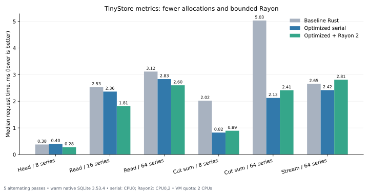

# TinyStore: serial Rust optimizations and Rayon

On this test setup, reducing allocations and using an exact accumulator delivered the main additional gains: `cut_sum`/`cut_avg` became 2.39–2.45 times faster than baseline Rust, and wide aggregates became 2.27–2.43 times faster. Two Rayon threads made a 16-series Read a further 1.30 times faster than optimized serial Rust. Rayon increased latency for wide Stream and several aggregates. These results do not support enabling parallelism for every query.

The measured run used a local, uncommitted research prototype. Production TinyStore was unchanged. The language comparison uses the preceding synchronous Rust prototype; Go calls the real public metrics API. The new run measured both baseline implementations again, so its ratios do not combine results from different sessions. It measures single-request latency, not server throughput under concurrent load. Publishing the preserved report does not turn that preliminary run into a formal measurement round.

Prototype changes:

- Rayon 1.11.0 processes independent series after the SQLite snapshot closes. The Connection remains on the calling thread. Time order and counter state are preserved within each series. Groups are merged exactly, with rounding after the merge.
- A bounded global pool is created before timing. Batches contain at most 8 series on two threads or 4 on one. Results and Stream callbacks are delivered in their original order; the queue does not collect the entire Stream. Normal mode selects Rayon for ≥2 series and ≥4096 samples to decode. Queries that use only summaries remain serial.
- `sum`/`avg` use 35 64-bit words, a 280-byte exact signed accumulator in units of 2^-1074. No BigInt is created for each decoded sample. Summaries continue to use their existing BigInts; the two parts are added exactly at output and use the preceding rounding rules. Count/min/max retain finite-value validation without creating a BigInt.
- Regular clocks fill Sample.at directly, without temporary delta/timestamp arrays. Uncompressed codec payloads are borrowed during decoding. Read reserves bounded result capacity in advance. Compressed payloads and irregular clocks retain the preceding path.

Measurements and correctness:

- 56 scenarios × 9 variants matched FNV hashes, float64 bits, timestamps, buckets, counts/resets/overflow/partial fields and the logical digest. Verification forces Rayon even for short queries. Selection plans and resource limits matched. After every timed write, the file was closed and reread by production Go.
- 21 Rust tests passed: every codec mode, extreme IEEE-754 values, every finite exponent, exact cancellation, signed zero, subnormals, overflow, summary/group merges, callback ordering, consumer stops and the precedence of a global limit over a later decode error. Go vet and cargo fmt --check passed.
- 39 workloads, five passes, 1135 timings with alternating variant order, plus 75 separate RSS processes. Variants used the same immutable fixtures, 32 warm operations and the same fixed operation count in each comparison. Maintain/expiry ran once without warming. Source and binary SHA-256 hashes were checked before and after measurement.
- Interval: 2026-10-08T14:38:21.649283+00:00 to 2026-10-08T14:41:47.773542+00:00. Go 1.27.1, Rust 1.99.0, AMD EPYC 9V74 VM, 3 visible vCPUs, a cgroup quota of 2 CPUs, 8 GiB RAM, overlayfs. Serial variants were pinned to CPU 0; the main Rayon 2 variant used CPUs 0,2. GOMAXPROCS=1. The VM does not reliably establish the host's physical-core topology.
- The kernel reports shared L1/L2 caches for CPUs 0,1 and separate caches for CPU 2. An additional Rayon 2 series on CPUs 0,1 is preserved separately. Differences between the CPU pairs are sometimes visible, limiting conclusions about physical-core scaling. Small differences, including serial write-path differences, cannot be attributed to Rayon: the writer is not parallelized here.
- SQLite 3.53.4, matching source_id and the preceding compile flags/PRAGMAs: 4096-byte pages, WAL/FULL, a 1 MiB cache, mmap=0, fullfsync and checkpoint_fullfsync enabled, foreign_keys=1, busy_timeout=5000, trusted_schema=0, wal_autocheckpoint=1000. Native SQLite retains THREADSAFE=1/Unix VFS, while the translated Go backend uses THREADSAFE=0/custom VFS. That is a preceding implementation difference, not an effect of these optimizations. SQLite/zstd are statically embedded; libm/libgcc_s/libc/the loader remain system libraries. Rayon added no dynamic SQLite dependency.
- The data fit in cache: the sealed fixture is 132 KiB and the wide fixture is 140 KiB. Wide contains 64 gauge series × 1441 samples = 92224 points, with 384 sealed blocks. The original scenarios and 17 floating-point edge scenarios were retained from the full comparison.

The pilot targeted approximately 120 ms of baseline Rust work. Timed registration is capped at 16 operations, scrape at 512, other writes at 4096 and reads/aggregates at 16384. Registration's warm+timed output must stay within the unchanged 100,000-point query ceiling. Both compared variants use the same retained count. One-shot and capped cases can have shorter measurement intervals.

All times below are medians of five passes. A ratio greater than 1 indicates a speedup. Individual pass ranges are available in summary.json; small differences on this VM should be interpreted cautiously.

| Workload | Go, ms | Baseline Rust, ms | Optimized Rust, ms | Rayon 1, ms | Rayon 2, ms | Baseline / serial | Serial / Rayon 2 |
|---|---:|---:|---:|---:|---:|---:|---:|
| ingest_append1 | 0.5312 | 0.4628 | 0.4231 | 0.4136 | 0.3981 | 1.09× | 1.06× |
| ingest_replace1 | 0.9376 | 0.5942 | 0.6930 | 0.6067 | 0.5519 | 0.86× | 1.26× |
| ingest_scrape100 | 6.2296 | 3.0891 | 2.6625 | 2.7832 | 2.8171 | 1.16× | 0.95× |
| ingest_register8 | 2.0110 | 1.1018 | 1.2260 | 1.2381 | 1.0467 | 0.90× | 1.17× |
| ingest_shuffled240 | 1.0834 | 0.6951 | 0.7310 | 0.7036 | 0.6032 | 0.95× | 1.21× |
| ingest_duplicates240 | 1.0212 | 0.6380 | 0.6343 | 0.6053 | 0.6315 | 1.01× | 1.00× |
| maintain_ready | 86.5382 | 31.6849 | 32.6437 | 33.6232 | 32.8562 | 0.97× | 0.99× |
| expire_all | 16.6914 | 10.4468 | 11.9471 | 10.7507 | 9.8146 | 0.87× | 1.22× |
| read_head_point | 0.0573 | 0.0173 | 0.0177 | 0.0174 | 0.0163 | 0.97× | 1.09× |
| read_head_full8 | 0.9791 | 0.3758 | 0.4004 | 0.3577 | 0.2755 | 0.94× | 1.45× |
| read_sealed_point | 0.0961 | 0.0317 | 0.0302 | 0.0322 | 0.0324 | 1.05× | 0.93× |
| read_sealed_boundary | 0.4760 | 0.1914 | 0.2014 | 0.2021 | 0.1794 | 0.95× | 1.12× |
| read_sealed_full8 | 2.8901 | 1.3259 | 1.1558 | 1.1583 | 0.9289 | 1.15× | 1.24× |
| read_sealed_full16 | 5.0729 | 2.5330 | 2.3641 | 2.2560 | 1.8139 | 1.07× | 1.30× |
| read_filtered_one | 0.4774 | 0.1629 | 0.1273 | 0.1319 | 0.1251 | 1.28× | 1.02× |
| stream_sealed_full8 | 2.9347 | 0.9867 | 1.0144 | 1.1007 | 0.8967 | 0.97× | 1.13× |
| read_where | 1.1404 | 0.4857 | 0.4179 | 0.4227 | 0.4405 | 1.16× | 0.95× |
| read_prefix | 0.4230 | 0.1603 | 0.1476 | 0.1492 | 0.1630 | 1.09× | 0.91× |
| read_noneof | 2.1524 | 0.9198 | 0.8259 | 0.8705 | 0.8009 | 1.11× | 1.03× |
| read_since | 0.8343 | 0.3348 | 0.3094 | 0.3207 | 0.3809 | 1.08× | 0.81× |
| aggregate_count | 0.3792 | 0.1535 | 0.1554 | 0.1666 | 0.1803 | 0.99× | 0.86× |
| aggregate_sum | 0.4479 | 0.2027 | 0.2022 | 0.2238 | 0.1833 | 1.00× | 1.10× |
| aggregate_avg | 0.4600 | 0.1957 | 0.1976 | 0.1971 | 0.1871 | 0.99× | 1.06× |
| aggregate_min | 0.4360 | 0.1745 | 0.1688 | 0.1749 | 0.1786 | 1.03× | 0.95× |
| aggregate_max | 0.4423 | 0.1819 | 0.1775 | 0.1714 | 0.1560 | 1.02× | 1.14× |
| aggregate_delta | 0.4185 | 0.1836 | 0.1812 | 0.1784 | 0.1882 | 1.01× | 0.96× |
| aggregate_increase | 0.4430 | 0.2222 | 0.2210 | 0.2227 | 0.2258 | 1.01× | 0.98× |
| aggregate_rate | 0.4316 | 0.2095 | 0.2168 | 0.2322 | 0.2284 | 0.97× | 0.95× |
| aggregate_cut_sum | 2.2670 | 2.0202 | 0.8238 | 0.8544 | 0.8931 | 2.45× | 0.92× |
| aggregate_cut_avg | 2.4285 | 2.0188 | 0.8435 | 0.8870 | 0.7987 | 2.39× | 1.06× |
| aggregate_grouped_sum | 0.3988 | 0.1922 | 0.2009 | 0.1894 | 0.1863 | 0.96× | 1.08× |
| aggregate_grouped_increase | 0.4612 | 0.2281 | 0.2275 | 0.2369 | 0.2254 | 1.00× | 1.01× |
| read_wide64 | 6.1786 | 3.1155 | 2.8339 | 2.9071 | 2.6006 | 1.10× | 1.09× |
| stream_wide64 | 6.3033 | 2.6537 | 2.4170 | 2.6173 | 2.8076 | 1.10× | 0.86× |
| aggregate_wide_sum | 1.2477 | 0.6550 | 0.6872 | 0.7599 | 0.6698 | 0.95× | 1.03× |
| aggregate_wide_cut_sum | 5.2568 | 5.0345 | 2.1257 | 2.2532 | 2.4112 | 2.37× | 0.88× |
| aggregate_wide_cut_avg | 5.5686 | 5.1116 | 2.1037 | 2.3906 | 2.2623 | 2.43× | 0.93× |
| aggregate_wide_cut_count | 4.6001 | 4.3211 | 1.8354 | 2.2199 | 1.9321 | 2.35× | 0.95× |
| aggregate_wide_grouped_cut_sum | 5.0464 | 4.8715 | 2.1426 | 2.2643 | 2.0387 | 2.27× | 1.05× |

Disabling optimizations separately helps estimate each component's contribution:

| Workload | Refactoring only, ms | Exact accumulator only, ms | Codec/reservation only, ms | Both optimizations, ms | Rayon 2 on CPUs 0,1, ms |
|---|---:|---:|---:|---:|---:|
| maintain_ready | 32.2711 | 35.6044 | 34.2876 | 32.6437 | 33.5498 |
| read_sealed_full16 | 2.5688 | 2.3694 | 2.1880 | 2.3641 | 1.8299 |
| aggregate_count | 0.1807 | 0.1625 | 0.1592 | 0.1554 | 0.1594 |
| aggregate_cut_sum | 2.1503 | 0.8771 | 2.1237 | 0.8238 | 0.8030 |
| aggregate_cut_avg | 2.1936 | 0.8882 | 2.1571 | 0.8435 | 0.7796 |
| read_wide64 | 3.1954 | 3.1292 | 2.7613 | 2.8339 | 2.3674 |
| aggregate_wide_cut_sum | 5.4746 | 2.4057 | 4.9434 | 2.1257 | 2.1555 |
| aggregate_wide_grouped_cut_sum | 5.5385 | 2.2461 | 5.3158 | 2.1426 | 2.0872 |

For `cut_sum`, the exact accumulator alone reduced latency from 2.150 to 0.877 ms relative to the same refactoring with optimizations disabled. Codec changes alone had little effect on this aggregate. For a 16-series Read, codec/reservation changes reduced latency from 2.569 to 2.188 ms. Switching the exact accumulator does not change the Read path; differences between those medians reflect variation.

Peak RSS, median of three processes, MiB:

| Workload | Go | Baseline Rust | Serial Rust | Rayon 1 | Rayon 2 |
|---|---:|---:|---:|---:|---:|
| read_sealed_full16 | 50.53 | 23.38 | 23.20 | 23.30 | 23.20 |
| read_wide64 | 65.47 | 31.32 | 27.51 | 27.75 | 27.77 |
| stream_wide64 | 15.57 | 4.20 | 4.39 | 4.55 | 4.79 |
| aggregate_cut_sum | 14.34 | 4.06 | 4.25 | 4.36 | 4.36 |
| aggregate_wide_cut_sum | 15.18 | 5.02 | 5.26 | 5.30 | 5.40 |

Read/aggregate retain 16 results. Stream consumes one series at a time and retains only the last. For Read wide64, reservation reduced peak RSS from 31.32 to 27.51 MiB; Rayon 2 used 27.77 MiB. For Stream wide64, peak RSS grew from 4.39 to 4.79 MiB when two threads were enabled. This is process RSS, including SQLite/zstd/allocators/stacks, not just the Rust heap. GNU time and sampled VmRSS on Linux can differ slightly; the original values are preserved. Parallel queues are bounded, but production shared reservations and a shared concurrent memory budget are not implemented in the prototype.

The practical next step is to carry forward the exact accumulator and remove unnecessary buffers first. Select Rayon according to the amount of actual decoding and the query type; the current threshold is experimental and does not prevent every regression. Production work also requires measurements of concurrent load and a shared bounded pool, so requests do not create competing CPU pools. A serialized SQLite writer does not become faster merely by using par_iter; parallel data preparation before the transaction is a separate experiment.

The preceding Rust prototype's omissions remain: reader pooling/admission, shared reservations, caller cancellation, instruments, runtime directory locking/lifecycle and background tasks were not ported. These results make no claim about cold disk, power-loss durability or linear scaling on 8–16 cores.

Reproduce from `<repo>/tinystore/metrics-opt-bench` following the [harness instructions](../metrics-opt-bench/README.md). [Raw data](data/metrics-optimization-2026-10-08/summary.json) · [Preceding full comparison](metrics-native-2026-10-08.md)

## Later research

The deeper round remeasures the optimized Rust baseline and checks four further switches plus compiler variants. See the [final synthesis](rust-research-summary-2026-10-08.md) and
[deeper optimization round](metrics-deep-2026-10-08.md). The original numbers
above remain historical measurements from their own session.
